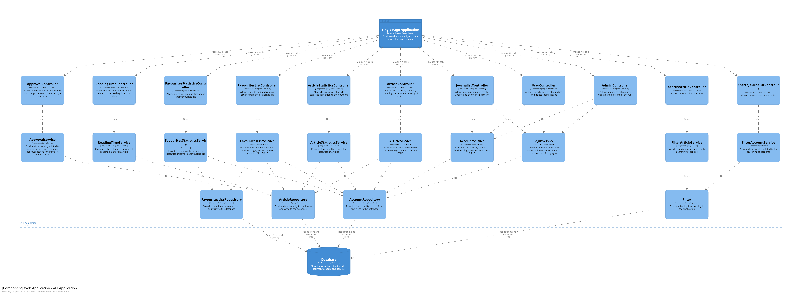

# Marro News - Backend

## Introduction

**Marro News - Backend** is the REST API powering the Marro News web application. This project was developed as an educational assignment for Semester 3 at Fontys University of Applied Sciences. It provides robust backend services for user authentication, article management, statistics, and real-time updates, following modern software engineering practices.

This repository is intended for educational purposes. If you wish to use, modify, or publish any part of this codebase, please contact the author for permission. Unauthorized redistribution or modification is not allowed.

## Tech Stack


## Software Architecture

The backend follows a layered architecture using Spring Boot, with clear separation of concerns between controllers, services, repositories, and domain models.

**C3 Context Diagram:**



---

## Features

- JWT-based authentication & role-based authorization (Admin, Journalist, User)
- Article management with approval workflow
- Favourites list per user
- Article & favourites statistics
- Real-time updates via WebSocket
- Article and journalist search with filtering
- CI/CD pipeline with build, test, SonarQube analysis, and Docker deployment

## Getting Started

### Prerequisites

- Java 17
- Gradle
- Microsoft SQL Server (or use the H2 in-memory DB for testing)
- Docker (optional)

### Run locally

```bash
./gradlew bootRun
```

### Run tests

```bash
./gradlew test
```

### Build & run with Docker

```bash
./gradlew assemble
docker build -t marro-news-backend .
docker run -p 8080:8080 marro-news-backend
```


## File Structure

The main project structure is as follows:

```
src/
	main/
		java/nl/fontys/newswebapplication/
			controllers/      # REST controllers
			domain/           # Domain models and enums
			repositories/     # Data access layer
			services/         # Business logic
		resources/          # Application properties
	test/
		java/nl/fontys/newswebapplication/  # Unit and integration tests
build.gradle            # Gradle build file
Dockerfile              # Docker containerization
README.md               # Project documentation
```

---

## Documentation

This repository includes additional system and project documentation to support understanding of the architecture, design decisions, and quality assurance processes.

All documentation is stored in the `docs/` folder:

- **C3 diagram**: system-level architecture overview  
  [View C3 diagram](docs/C3.png)

- **UML class diagram**: structural representation of domain models and relationships  
  [View UML diagram](docs/uml_class_diagram_news.pdf)

- **Design document (C4 + architecture decisions)**: system design using C4 diagrams, key architectural decisions, and technology stack choices  
  [View design document](docs/design_document.pdf)

- **Security report (OWASP Top 10)**: security analysis mapped against OWASP Top 10 risks, including mitigations and findings  
  [View security report](docs/security_report.pdf)

- **SonarQube report**: code quality, maintainability, and static analysis results  
  [View SonarQube report](docs/sonarqube_report.pdf)

- **UX report**: user experience analysis and design considerations  
  [View UX report](docs/ux_report.pdf)

These documents provide additional context for reviewers and are intended to complement the implementation by illustrating design reasoning, system structure, security considerations, and engineering quality practices.

---

## License & Usage

This project is distributed for educational use only. **Not for commercial use.**

- Please request permission before modifying or publishing any part of this repository.
- For questions or collaboration, contact the project author.